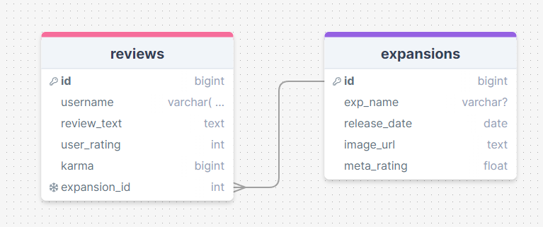

Build a comment form
Overview
You've built a simple blog, your task now is to embellish it. Use database relationships to add a comments table. Add categories and tags to your posts. Add a form to create new comments. Add an edit page that populates the form with the post data and allows you save changes to the database.

You can use Vercel Postgres or Supabase, so long as Postgres is the database.

Example: Blog

User Stories
🐿️ As a user, I want to browse a list of posts, sortable by ascending or descending order
🐿️ As a user, I want to be able to leave a comment sharing my thoughts on each post
Stretch goal:
🐿️ As a user, I want to see a list of categories, and click on a category to see a list of posts in that category
Requirements
IMPORTANT: You don't have to make a generic blog with posts. It can be ANYTHING! So long as you are able to comment on it, it could be recipes, reviews, products, job listings, podcast episodes, movies etc etc etc

🎯 Created using create-next-app

🎯 Design a SQL schema for a posts table, and a comments table that has a post_id column connecting it to the posts table.

🎯 Either create a form where users can add posts OR seed your database with at least 4 posts that comments can be added to (if you do the seed, one of the stretch goals will be harder).

🎯 Add a form to the individual post page to allow creating a new comment, which is saved to the new comments table including the Post ID.

🎯 Refresh the /posts route data when adding a new post, and redirect the user to the list of posts

🎯 Refresh the /post/:postId route when adding a new comment, so the new comment is displayed on the page

🎯 Add static and dynamic metadata to your pages

Please also provide an assignment reflection in your project README.md file.
(Required)
🎯 Please mention the requirements you met and which goals you achieved for this assignment.

- I think I met all the basic requirements. I wasn't well over the weekend or else I would have loved to add edit/delete functionality. It was nice to get the dynamic routes working and actually quite simple once you know what you're doing. I especially like how easy it is to add more pages in NextJS.

🎯 Were there any requirements or goals that you were not quite able to achieve?

- I would have liked to be more ambitious with the app, I really like how the basic functionality works right now.

🎯 If so, could you please tell us what was it that you found difficult about these tasks?

- I found it a little tricky to remember how to pass props from the expansion review page to the form component. I wanted to make sure the dropdown list was on the correct expansion by default. Having thought about it though, perhaps the dropdown list wasn't really necessary and the prop could be used to dynamically change the SQL post query.

(Optional)
🏹 Feel free to add any other reflections you would like to share about your submission e.g.

## What went really well and what could have gone better?

- I enjoyed getting used to Next.js server side routing.

Detailing useful external sources that helped you complete the assignment (e.g Youtube tutorials).

[CSS button styles](https://getcssscan.com/css-buttons-examples)

Describing errors or bugs you encountered while completing your assignment.
Requesting feedback about a specific part of your submission.

